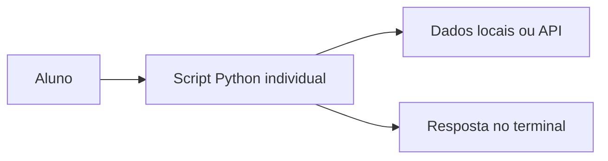

# Estrutura — Atividade6-EdN

```mermaid
flowchart LR
  Aluno --> Script["Script Python individual"]
  Script --> Entrada["Dados locais ou API"]
  Script --> Resultado["Resposta no terminal"]
```

Scripts existentes: 1/gerador_senha.py, 2/perfil_aleatorio.py, 3/consulta_cep.py, 4/cotacao_moeda.py. Diagrama de aprendizagem, não arquitetura de backend integrado.
